# MiniMind Teaching Plan: Full-Circle LLM Development

> **A hands-on course using the MiniMind repository to teach every stage of Large Language Model development — from tokenizer training to deployment — all runnable on Google Colab.**

---

## Code Structure Graph

```mermaid
graph TB
    subgraph "📦 Repository Structure"
        ROOT["minimind-colab/"]
    end

    subgraph "🧠 Model Architecture (model/)"
        MM_CONFIG["MiniMindConfig<br/>─ hidden_size, num_layers<br/>─ MoE, RoPE, GQA params"]
        MM_MODEL["MiniMindForCausalLM<br/>─ Embedding + N×Blocks + LMHead<br/>─ Weight tying"]
        ATTN["Attention<br/>─ Multi-head / GQA<br/>─ RoPE + FlashAttention<br/>─ KV-Cache"]
        FFN["FeedForward<br/>─ SiLU gated FFN"]
        MOE["MOEFeedForward<br/>─ Router + N Experts<br/>─ Auxiliary loss"]
        BLOCK["MiniMindBlock<br/>─ Pre-norm (RMSNorm)<br/>─ Attention + FFN residual"]
        LORA["LoRA Module<br/>─ Low-rank A·B matrices<br/>─ apply/load/save/merge"]
        TOKENIZER["Tokenizer<br/>─ BPE + ByteLevel<br/>─ 6400 vocab, 36 special tokens"]

        MM_CONFIG --> MM_MODEL
        MM_MODEL --> BLOCK
        BLOCK --> ATTN
        BLOCK --> FFN
        BLOCK --> MOE
        MM_MODEL -.-> LORA
        ROOT --> TOKENIZER
    end

    subgraph "📊 Data Pipeline (dataset/)"
        PRETRAIN_DS["PretrainDataset<br/>─ Raw text → BOS+tokens+EOS<br/>─ JSONL format"]
        SFT_DS["SFTDataset<br/>─ Chat template formatting<br/>─ Label masking (-100)"]
        DPO_DS["DPODataset<br/>─ Chosen/rejected pairs<br/>─ Loss mask generation"]
        RLAIF_DS["RLAIFDataset<br/>─ Prompt-only for rollout<br/>─ Thinking toggle"]
        AGENT_DS["AgentRLDataset<br/>─ Tool-use conversations<br/>─ Ground truth validation"]
    end

    subgraph "🏋️ Training Pipeline (trainer/)"
        UTILS["trainer_utils.py<br/>─ init_model, get_lr<br/>─ DDP, checkpointing"]
        T_PRETRAIN["train_pretrain.py<br/>─ Causal LM (next-token)<br/>─ AMP + DDP"]
        T_SFT["train_full_sft.py<br/>─ Instruction tuning<br/>─ Response-only loss"]
        T_LORA["train_lora.py<br/>─ LoRA fine-tuning<br/>─ Freeze base params"]
        T_DPO["train_dpo.py<br/>─ Direct Preference Optimization<br/>─ Ref model + Policy model"]
        T_PPO["train_ppo.py<br/>─ PPO with Critic<br/>─ GAE advantage estimation"]
        T_GRPO["train_grpo.py<br/>─ Group Relative PO<br/>─ Multi-generation ranking"]
        T_AGENT["train_agent.py<br/>─ Agent RL for tool use<br/>─ Multi-turn rollout"]
        T_DISTILL["train_distillation.py<br/>─ Teacher→Student KD<br/>─ KL divergence loss"]
        T_TOK["train_tokenizer.py<br/>─ BPE tokenizer training<br/>─ From scratch"]
        ROLLOUT["rollout_engine.py<br/>─ TorchRolloutEngine<br/>─ Per-token log probs"]

        UTILS --> T_PRETRAIN
        UTILS --> T_SFT
        UTILS --> T_LORA
        UTILS --> T_DPO
        UTILS --> T_PPO
        UTILS --> T_GRPO
        UTILS --> T_AGENT
        UTILS --> T_DISTILL
        ROLLOUT --> T_PPO
        ROLLOUT --> T_GRPO
        ROLLOUT --> T_AGENT
    end

    subgraph "🚀 Inference & Deployment (scripts/)"
        EVAL["eval_llm.py<br/>─ Interactive CLI chat<br/>─ Streaming generation"]
        API["serve_openai_api.py<br/>─ OpenAI-compatible API<br/>─ FastAPI + streaming"]
        WEBUI["web_demo.py<br/>─ Streamlit chat UI<br/>─ Multi-turn + thinking"]
        TOOLEVAL["eval_toolcall.py<br/>─ Tool calling eval<br/>─ Accuracy metrics"]
        CONVERT["convert_model.py<br/>─ PyTorch → HuggingFace<br/>─ LoRA merge"]
    end

    %% Data flow connections
    PRETRAIN_DS --> T_PRETRAIN
    SFT_DS --> T_SFT
    SFT_DS --> T_LORA
    DPO_DS --> T_DPO
    RLAIF_DS --> T_PPO
    RLAIF_DS --> T_GRPO
    AGENT_DS --> T_AGENT

    %% Training pipeline flow
    T_TOK -.->|"Step 0"| TOKENIZER
    T_PRETRAIN -->|"Step 1: Base model"| T_SFT
    T_SFT -->|"Step 2: Chat model"| T_LORA
    T_SFT -->|"Step 2: Chat model"| T_DPO
    T_DPO -->|"Step 3: Aligned"| T_PPO
    T_DPO -->|"Step 3: Aligned"| T_GRPO
    T_GRPO -->|"Step 4: RL-tuned"| T_AGENT
    T_DISTILL -.->|"Optional"| T_SFT

    %% Inference connections
    T_SFT --> EVAL
    T_LORA --> EVAL
    EVAL --> API
    EVAL --> WEBUI
    T_AGENT --> TOOLEVAL

    classDef config fill:#e1f5fe,stroke:#0288d1
    classDef model fill:#f3e5f5,stroke:#7b1fa2
    classDef data fill:#e8f5e9,stroke:#388e3c
    classDef train fill:#fff3e0,stroke:#f57c00
    classDef deploy fill:#fce4ec,stroke:#c62828

    class MM_CONFIG,TOKENIZER config
    class MM_MODEL,ATTN,FFN,MOE,BLOCK,LORA model
    class PRETRAIN_DS,SFT_DS,DPO_DS,RLAIF_DS,AGENT_DS data
    class UTILS,T_PRETRAIN,T_SFT,T_LORA,T_DPO,T_PPO,T_GRPO,T_AGENT,T_DISTILL,T_TOK,ROLLOUT train
    class EVAL,API,WEBUI,TOOLEVAL,CONVERT deploy
```



---

## Course Overview

| Module | Topic | Key Concepts | Notebook | Estimated Time |
|--------|-------|-------------|----------|---------------|
| 1 | Introduction & Tokenization | BPE, vocab, special tokens | `01_Tokenizer.ipynb` | 30 min |
| 2 | Model Architecture | Transformer, RoPE, GQA, MoE, RMSNorm | `02_Architecture.ipynb` | 45 min |
| 3 | Pretraining | Causal LM, next-token prediction, AMP | `03_Pretraining.ipynb` | 60 min |
| 4 | Supervised Fine-Tuning | Full SFT, LoRA, chat templates | `04_SFT_and_LoRA.ipynb` | 60 min |
| 5 | Alignment | DPO, PPO, GRPO | `05_Alignment.ipynb` | 60 min |
| 6 | Advanced Topics | Agent RL, distillation, evaluation | `06_Advanced.ipynb` | 45 min |
| 7 | Inference & Deployment | Chat, API serving, model conversion | `07_Inference_and_Deployment.ipynb` | 30 min |

---

## Module 1: Introduction & Tokenization

### Learning Objectives
- Understand what tokenizers do and why they matter for LLMs
- Learn Byte-Pair Encoding (BPE) algorithm
- Train a custom tokenizer from scratch
- Understand special tokens and their roles in chat/tool-use models

### Key Concepts
1. **Why tokenization?** — Converting text to numbers the model understands
2. **BPE algorithm** — Iterative merging of frequent byte pairs
3. **Vocabulary design** — Size trade-offs (6400 tokens for MiniMind)
4. **Special tokens** — `<|im_start|>`, `<|im_end|>`, `<think>`, `<tool_call>` etc.
5. **Chat templates** — Jinja2 templates for structured conversations

### Hands-on Activities
- Train a BPE tokenizer on sample text data
- Inspect vocabulary and compression ratios
- Apply chat templates to conversations
- Experiment with tokenization of different languages

---

## Module 2: Model Architecture Deep Dive

### Learning Objectives
- Understand modern transformer architecture components
- Learn RoPE (Rotary Position Embedding) with YaRN scaling
- Understand Grouped Query Attention (GQA)
- Learn Mixture of Experts (MoE) architecture
- Analyze parameter counts and memory requirements

### Key Concepts
1. **RMSNorm** — Efficient pre-normalization
2. **Multi-Head Attention with GQA** — Shared KV heads for efficiency
3. **RoPE** — Rotary position encoding with YaRN extrapolation
4. **SiLU-gated FFN** — `down(SiLU(gate(x)) * up(x))`
5. **MoE routing** — Top-k expert selection with auxiliary loss
6. **Weight tying** — Embedding ↔ LM head sharing
7. **KV-Cache** — Efficient autoregressive inference

### Hands-on Activities
- Instantiate and inspect model architecture
- Visualize attention patterns
- Compare Dense vs MoE parameter counts
- Forward pass walkthrough with tensor shapes

---

## Module 3: Pretraining

### Learning Objectives
- Understand causal language modeling (next-token prediction)
- Learn mixed-precision training with AMP
- Understand gradient accumulation and learning rate scheduling
- Run a pretraining loop on sample data

### Key Concepts
1. **Causal LM objective** — Predict next token, cross-entropy loss
2. **Data preparation** — JSONL format, BOS/EOS tokens, padding
3. **Mixed precision** — bfloat16/float16 with GradScaler
4. **Cosine LR schedule** — Warm-up to decay
5. **Gradient accumulation** — Effective batch size scaling
6. **Checkpointing** — Save and resume training

### Hands-on Activities
- Prepare a small pretraining dataset
- Configure and run pretraining for a few steps
- Monitor loss curves
- Test generation from pretrained model

---

## Module 4: Supervised Fine-Tuning (Full SFT + LoRA)

### Learning Objectives
- Understand instruction tuning / SFT
- Learn chat template-based data formatting
- Understand label masking (train only on responses)
- Learn LoRA for parameter-efficient fine-tuning
- Compare full SFT vs LoRA approaches

### Key Concepts
1. **SFT data format** — Conversations with role-based messages
2. **Chat templates** — Structured input with `<|im_start|>` markers
3. **Label masking** — `-100` for non-response tokens
4. **Full SFT** — Update all model parameters
5. **LoRA** — Low-rank adaptation `W + A·B` (rank 16)
6. **Parameter efficiency** — LoRA trains ~5% of total params

### Hands-on Activities
- Format SFT data with chat templates
- Run full SFT on sample instructions
- Apply LoRA and run parameter-efficient fine-tuning
- Compare SFT vs LoRA training speeds and results
- Merge LoRA weights back into base model

---

## Module 5: Alignment (DPO + RLHF)

### Learning Objectives
- Understand the alignment problem in LLMs
- Learn Direct Preference Optimization (DPO)
- Learn Proximal Policy Optimization (PPO) for RLHF
- Understand Group Relative Policy Optimization (GRPO)

### Key Concepts
1. **Alignment** — Making models helpful, harmless, and honest
2. **DPO** — Preference learning without reward model
3. **PPO** — Actor-critic RL with value function
4. **GRPO** — Group-based advantage normalization
5. **Reward signals** — Length, repetition, thinking, reward model
6. **KL divergence** — Preventing policy collapse

### Hands-on Activities
- Prepare preference data (chosen/rejected pairs)
- Run DPO training loop
- Understand reward calculation in PPO
- Compare DPO vs PPO outputs

---

## Module 6: Advanced Topics

### Learning Objectives
- Learn agentic RL for tool-use capabilities
- Understand knowledge distillation (teacher→student)
- Evaluate model capabilities with benchmarks

### Key Concepts
1. **Agent RL** — Multi-turn tool calling with `<tool_call>` tags
2. **Tool definition** — JSON schema for function specs
3. **Rollout engine** — Multi-step generation with tool execution
4. **Knowledge distillation** — KL divergence from teacher logits
5. **Temperature scaling** — Softening probability distributions
6. **Evaluation** — Tool calling accuracy, response quality

### Hands-on Activities
- Define tools and run agent RL demonstration
- Set up teacher-student distillation
- Evaluate tool calling accuracy
- Compare distilled vs original model

---

## Module 7: Inference & Deployment

### Learning Objectives
- Run interactive chat inference
- Convert models to HuggingFace format
- Deploy an OpenAI-compatible API server
- Build a web chat interface

### Key Concepts
1. **Autoregressive generation** — Token-by-token with sampling
2. **Sampling strategies** — Temperature, top-p, top-k, repetition penalty
3. **Streaming** — Progressive token output
4. **Model conversion** — PyTorch `.pth` → HuggingFace format
5. **API deployment** — OpenAI-compatible REST API
6. **Web UI** — Streamlit-based chat interface

### Hands-on Activities
- Run interactive inference with different parameters
- Convert model to HuggingFace format
- Deploy API server and test with client
- Launch web demo (via ngrok on Colab)

---

## Prerequisites

- **Python** — Intermediate level (classes, functions, decorators)
- **PyTorch** — Basic tensor operations, nn.Module, training loops
- **Deep Learning** — Understanding of neural networks, backpropagation
- **Google Account** — For Google Colab access (free tier sufficient for most modules)

## Hardware Requirements (Google Colab)

| Module | GPU Required | Recommended Colab Tier |
|--------|-------------|----------------------|
| 1-2 | CPU or T4 | Free |
| 3-4 | T4 (16GB) | Free / Pro |
| 5-6 | T4 (16GB) | Pro |
| 7 | T4 (16GB) | Free / Pro |

> **Note:** MiniMind is specifically designed to be trainable on consumer GPUs. The 64M parameter model fits comfortably in a T4's 16GB VRAM. All notebooks use reduced batch sizes and sequence lengths optimized for Colab's T4 GPU.

---

## File Structure

```
minimind-colab/
├── TEACHING_PLAN.md              ← This file
├── notebooks/
│   ├── 01_Tokenizer.ipynb        ← Module 1: Tokenization
│   ├── 02_Architecture.ipynb     ← Module 2: Model Architecture
│   ├── 03_Pretraining.ipynb      ← Module 3: Pretraining
│   ├── 04_SFT_and_LoRA.ipynb     ← Module 4: SFT + LoRA
│   ├── 05_Alignment.ipynb        ← Module 5: DPO + RLHF
│   ├── 06_Advanced.ipynb         ← Module 6: Agent RL + Distillation
│   └── 07_Inference_and_Deployment.ipynb ← Module 7: Deployment
├── model/                        ← Model architecture
├── dataset/                      ← Data loading
├── trainer/                      ← Training scripts
├── scripts/                      ← Inference & deployment
└── requirements.txt              ← Dependencies
```

---

## How to Use This Course

1. **Open each notebook in Google Colab** — Click the "Open in Colab" badge at the top of each notebook
2. **Follow the modules in order** — Each module builds on the previous one
3. **Run all cells sequentially** — Each notebook is self-contained with setup cells
4. **Read the explanations** — Markdown cells explain concepts before code cells demonstrate them
5. **Experiment** — Modify hyperparameters, try different data, observe the effects

---

*Teaching plan created for the MiniMind-Colab project. All materials are designed to run on Google Colab with a free-tier T4 GPU.*
