# MiniMind Teaching Plan: Full-Circle LLM Development

> **A hands-on course using the MiniMind repository to teach every stage of Large Language Model development — from tokenizer training to deployment — all runnable on Google Colab.**

---

## Code Structure Graph

```mermaid
graph TB
    subgraph "📦 Repository Structure"
        ROOT["minimind-colab/"]
    end

    subgraph "🧠 Model Architecture (model/)"
        MM_CONFIG["MiniMindConfig<br/>─ hidden_size, num_layers<br/>─ MoE, RoPE, GQA params"]
        MM_MODEL["MiniMindForCausalLM<br/>─ Embedding + N×Blocks + LMHead<br/>─ Weight tying"]
        ATTN["Attention<br/>─ Multi-head / GQA<br/>─ RoPE + FlashAttention<br/>─ KV-Cache"]
        FFN["FeedForward<br/>─ SiLU gated FFN"]
        MOE["MOEFeedForward<br/>─ Router + N Experts<br/>─ Auxiliary loss"]
        BLOCK["MiniMindBlock<br/>─ Pre-norm (RMSNorm)<br/>─ Attention + FFN residual"]
        LORA["LoRA Module<br/>─ Low-rank A·B matrices<br/>─ apply/load/save/merge"]
        TOKENIZER["Tokenizer<br/>─ BPE + ByteLevel<br/>─ 6400 vocab, 36 special tokens"]

        MM_CONFIG --> MM_MODEL
        MM_MODEL --> BLOCK
        BLOCK --> ATTN
        BLOCK --> FFN
        BLOCK --> MOE
        MM_MODEL -.-> LORA
        ROOT --> TOKENIZER
    end

    subgraph "📊 Data Pipeline (dataset/)"
        PRETRAIN_DS["PretrainDataset<br/>─ Raw text → BOS+tokens+EOS<br/>─ JSONL format"]
        SFT_DS["SFTDataset<br/>─ Chat template formatting<br/>─ Label masking (-100)"]
        DPO_DS["DPODataset<br/>─ Chosen/rejected pairs<br/>─ Loss mask generation"]
        RLAIF_DS["RLAIFDataset<br/>─ Prompt-only for rollout<br/>─ Thinking toggle"]
        AGENT_DS["AgentRLDataset<br/>─ Tool-use conversations<br/>─ Ground truth validation"]
    end

    subgraph "🏋️ Training Pipeline (trainer/)"
        UTILS["trainer_utils.py<br/>─ init_model, get_lr<br/>─ DDP, checkpointing"]
        T_PRETRAIN["train_pretrain.py<br/>─ Causal LM (next-token)<br/>─ AMP + DDP"]
        T_SFT["train_full_sft.py<br/>─ Instruction tuning<br/>─ Response-only loss"]
        T_LORA["train_lora.py<br/>─ LoRA fine-tuning<br/>─ Freeze base params"]
        T_DPO["train_dpo.py<br/>─ Direct Preference Optimization<br/>─ Ref model + Policy model"]
        T_PPO["train_ppo.py<br/>─ PPO with Critic<br/>─ GAE advantage estimation"]
        T_GRPO["train_grpo.py<br/>─ Group Relative PO<br/>─ Multi-generation ranking"]
        T_AGENT["train_agent.py<br/>─ Agent RL for tool use<br/>─ Multi-turn rollout"]
        T_DISTILL["train_distillation.py<br/>─ Teacher→Student KD<br/>─ KL divergence loss"]
        T_TOK["train_tokenizer.py<br/>─ BPE tokenizer training<br/>─ From scratch"]
        ROLLOUT["rollout_engine.py<br/>─ TorchRolloutEngine<br/>─ Per-token log probs"]

        UTILS --> T_PRETRAIN
        UTILS --> T_SFT
        UTILS --> T_LORA
        UTILS --> T_DPO
        UTILS --> T_PPO
        UTILS --> T_GRPO
        UTILS --> T_AGENT
        UTILS --> T_DISTILL
        ROLLOUT --> T_PPO
        ROLLOUT --> T_GRPO
        ROLLOUT --> T_AGENT
    end

    subgraph "🚀 Inference & Deployment (scripts/)"
        EVAL["eval_llm.py<br/>─ Interactive CLI chat<br/>─ Streaming generation"]
        API["serve_openai_api.py<br/>─ OpenAI-compatible API<br/>─ FastAPI + streaming"]
        WEBUI["web_demo.py<br/>─ Streamlit chat UI<br/>─ Multi-turn + thinking"]
        TOOLEVAL["eval_toolcall.py<br/>─ Tool calling eval<br/>─ Accuracy metrics"]
        CONVERT["convert_model.py<br/>─ PyTorch → HuggingFace<br/>─ LoRA merge"]
    end

    %% Data flow connections
    PRETRAIN_DS --> T_PRETRAIN
    SFT_DS --> T_SFT
    SFT_DS --> T_LORA
    DPO_DS --> T_DPO
    RLAIF_DS --> T_PPO
    RLAIF_DS --> T_GRPO
    AGENT_DS --> T_AGENT

    %% Training pipeline flow
    T_TOK -.->|"Step 0"| TOKENIZER
    T_PRETRAIN -->|"Step 1: Base model"| T_SFT
    T_SFT -->|"Step 2: Chat model"| T_LORA
    T_SFT -->|"Step 2: Chat model"| T_DPO
    T_DPO -->|"Step 3: Aligned"| T_PPO
    T_DPO -->|"Step 3: Aligned"| T_GRPO
    T_GRPO -->|"Step 4: RL-tuned"| T_AGENT
    T_DISTILL -.->|"Optional"| T_SFT

    %% Inference connections
    T_SFT --> EVAL
    T_LORA --> EVAL
    EVAL --> API
    EVAL --> WEBUI
    T_AGENT --> TOOLEVAL

    classDef config fill:#e1f5fe,stroke:#0288d1
    classDef model fill:#f3e5f5,stroke:#7b1fa2
    classDef data fill:#e8f5e9,stroke:#388e3c
    classDef train fill:#fff3e0,stroke:#f57c00
    classDef deploy fill:#fce4ec,stroke:#c62828

    class MM_CONFIG,TOKENIZER config
    class MM_MODEL,ATTN,FFN,MOE,BLOCK,LORA model
    class PRETRAIN_DS,SFT_DS,DPO_DS,RLAIF_DS,AGENT_DS data
    class UTILS,T_PRETRAIN,T_SFT,T_LORA,T_DPO,T_PPO,T_GRPO,T_AGENT,T_DISTILL,T_TOK,ROLLOUT train
    class EVAL,API,WEBUI,TOOLEVAL,CONVERT deploy
```



---

## Course Overview

| Module | Topic | Key Concepts | Notebook | Estimated Time |
|--------|-------|-------------|----------|---------------|
| 1 | Introduction & Tokenization | BPE, vocab, special tokens | `01_Tokenizer.ipynb` | 30 min |
| 2 | Model Architecture | Transformer, RoPE, GQA, MoE, RMSNorm | `02_Architecture.ipynb` | 45 min |
| 3 | Pretraining | Causal LM, next-token prediction, AMP | `03_Pretraining.ipynb` | 60 min |
| 4 | Supervised Fine-Tuning | Full SFT, LoRA, chat templates | `04_SFT_and_LoRA.ipynb` | 60 min |
| 5 | Alignment | DPO, PPO, GRPO | `05_Alignment.ipynb` | 60 min |
| 6 | Advanced Topics | Agent RL, distillation, evaluation | `06_Advanced.ipynb` | 45 min |
| 7 | Inference & Deployment | Chat, API serving, model conversion | `07_Inference_and_Deployment.ipynb` | 30 min |

---

## Module 1: Introduction & Tokenization

### Learning Objectives
- Understand what tokenizers do and why they matter for LLMs
- Learn Byte-Pair Encoding (BPE) algorithm
- Train a custom tokenizer from scratch
- Understand special tokens and their roles in chat/tool-use models

### Key Concepts
1. **Why tokenization?** — Converting text to numbers the model understands
2. **BPE algorithm** — Iterative merging of frequent byte pairs
3. **Vocabulary design** — Size trade-offs (6400 tokens for MiniMind)
4. **Special tokens** — `<|im_start|>`, `<|im_end|>`, `<think>`, `<tool_call>` etc.
5. **Chat templates** — Jinja2 templates for structured conversations

### Hands-on Activities
- Train a BPE tokenizer on sample text data
- Inspect vocabulary and compression ratios
- Apply chat templates to conversations
- Experiment with tokenization of different languages

---

## Module 2: Model Architecture Deep Dive

### Learning Objectives
- Understand modern transformer architecture components
- Learn RoPE (Rotary Position Embedding) with YaRN scaling
- Understand Grouped Query Attention (GQA)
- Learn Mixture of Experts (MoE) architecture
- Analyze parameter counts and memory requirements

### Key Concepts
1. **RMSNorm** — Efficient pre-normalization
2. **Multi-Head Attention with GQA** — Shared KV heads for efficiency
3. **RoPE** — Rotary position encoding with YaRN extrapolation
4. **SiLU-gated FFN** — `down(SiLU(gate(x)) * up(x))`
5. **MoE routing** — Top-k expert selection with auxiliary loss
6. **Weight tying** — Embedding ↔ LM head sharing
7. **KV-Cache** — Efficient autoregressive inference

### Hands-on Activities
- Instantiate and inspect model architecture
- Visualize attention patterns
- Compare Dense vs MoE parameter counts
- Forward pass walkthrough with tensor shapes

---

## Module 3: Pretraining

### Learning Objectives
- Understand causal language modeling (next-token prediction)
- Learn mixed-precision training with AMP
- Understand gradient accumulation and learning rate scheduling
- Run a pretraining loop on sample data

### Key Concepts
1. **Causal LM objective** — Predict next token, cross-entropy loss
2. **Data preparation** — JSONL format, BOS/EOS tokens, padding
3. **Mixed precision** — bfloat16/float16 with GradScaler
4. **Cosine LR schedule** — Warm-up to decay
5. **Gradient accumulation** — Effective batch size scaling
6. **Checkpointing** — Save and resume training

### Hands-on Activities
- Prepare a small pretraining dataset
- Configure and run pretraining for a few steps
- Monitor loss curves
- Test generation from pretrained model

---

## Module 4: Supervised Fine-Tuning (Full SFT + LoRA)

### Learning Objectives
- Understand instruction tuning / SFT
- Learn chat template-based data formatting
- Understand label masking (train only on responses)
- Learn LoRA for parameter-efficient fine-tuning
- Compare full SFT vs LoRA approaches

### Key Concepts
1. **SFT data format** — Conversations with role-based messages
2. **Chat templates** — Structured input with `<|im_start|>` markers
3. **Label masking** — `-100` for non-response tokens
4. **Full SFT** — Update all model parameters
5. **LoRA** — Low-rank adaptation `W + A·B` (rank 16)
6. **Parameter efficiency** — LoRA trains ~5% of total params

### Hands-on Activities
- Format SFT data with chat templates
- Run full SFT on sample instructions
- Apply LoRA and run parameter-efficient fine-tuning
- Compare SFT vs LoRA training speeds and results
- Merge LoRA weights back into base model

---

## Module 5: Alignment (DPO + RLHF)

### Learning Objectives
- Understand the alignment problem in LLMs
- Learn Direct Preference Optimization (DPO)
- Learn Proximal Policy Optimization (PPO) for RLHF
- Understand Group Relative Policy Optimization (GRPO)

### Key Concepts
1. **Alignment** — Making models helpful, harmless, and honest
2. **DPO** — Preference learning without reward model
3. **PPO** — Actor-critic RL with value function
4. **GRPO** — Group-based advantage normalization
5. **Reward signals** — Length, repetition, thinking, reward model
6. **KL divergence** — Preventing policy collapse

### Hands-on Activities
- Prepare preference data (chosen/rejected pairs)
- Run DPO training loop
- Understand reward calculation in PPO
- Compare DPO vs PPO outputs

---

## Module 6: Advanced Topics

### Learning Objectives
- Learn agentic RL for tool-use capabilities
- Understand knowledge distillation (teacher→student)
- Evaluate model capabilities with benchmarks

### Key Concepts
1. **Agent RL** — Multi-turn tool calling with `<tool_call>` tags
2. **Tool definition** — JSON schema for function specs
3. **Rollout engine** — Multi-step generation with tool execution
4. **Knowledge distillation** — KL divergence from teacher logits
5. **Temperature scaling** — Softening probability distributions
6. **Evaluation** — Tool calling accuracy, response quality

### Hands-on Activities
- Define tools and run agent RL demonstration
- Set up teacher-student distillation
- Evaluate tool calling accuracy
- Compare distilled vs original model

---

## Module 7: Inference & Deployment

### Learning Objectives
- Run interactive chat inference
- Convert models to HuggingFace format
- Deploy an OpenAI-compatible API server
- Build a web chat interface

### Key Concepts
1. **Autoregressive generation** — Token-by-token with sampling
2. **Sampling strategies** — Temperature, top-p, top-k, repetition penalty
3. **Streaming** — Progressive token output
4. **Model conversion** — PyTorch `.pth` → HuggingFace format
5. **API deployment** — OpenAI-compatible REST API
6. **Web UI** — Streamlit-based chat interface

### Hands-on Activities
- Run interactive inference with different parameters
- Convert model to HuggingFace format
- Deploy API server and test with client
- Launch web demo (via ngrok on Colab)

---

## Prerequisites

- **Python** — Intermediate level (classes, functions, decorators)
- **PyTorch** — Basic tensor operations, nn.Module, training loops
- **Deep Learning** — Understanding of neural networks, backpropagation
- **Google Account** — For Google Colab access (free tier sufficient for most modules)

## Hardware Requirements (Google Colab)

| Module | GPU Required | Recommended Colab Tier |
|--------|-------------|----------------------|
| 1-2 | CPU or T4 | Free |
| 3-4 | T4 (16GB) | Free / Pro |
| 5-6 | T4 (16GB) | Pro |
| 7 | T4 (16GB) | Free / Pro |

> **Note:** MiniMind is specifically designed to be trainable on consumer GPUs. The 64M parameter model fits comfortably in a T4's 16GB VRAM. All notebooks use reduced batch sizes and sequence lengths optimized for Colab's T4 GPU.

---

## File Structure

```
minimind-colab/
├── TEACHING_PLAN.md              ← This file
├── notebooks/
│   ├── 01_Tokenizer.ipynb        ← Module 1: Tokenization
│   ├── 02_Architecture.ipynb     ← Module 2: Model Architecture
│   ├── 03_Pretraining.ipynb      ← Module 3: Pretraining
│   ├── 04_SFT_and_LoRA.ipynb     ← Module 4: SFT + LoRA
│   ├── 05_Alignment.ipynb        ← Module 5: DPO + RLHF
│   ├── 06_Advanced.ipynb         ← Module 6: Agent RL + Distillation
│   └── 07_Inference_and_Deployment.ipynb ← Module 7: Deployment
├── model/                        ← Model architecture
├── dataset/                      ← Data loading
├── trainer/                      ← Training scripts
├── scripts/                      ← Inference & deployment
└── requirements.txt              ← Dependencies
```

---

## How to Use This Course

1. **Open each notebook in Google Colab** — Click the "Open in Colab" badge at the top of each notebook
2. **Follow the modules in order** — Each module builds on the previous one
3. **Run all cells sequentially** — Each notebook is self-contained with setup cells
4. **Read the explanations** — Markdown cells explain concepts before code cells demonstrate them
5. **Experiment** — Modify hyperparameters, try different data, observe the effects

---

## 6-Session Classroom Implementation Plan

> The 7 modules above map to **6 one-hour live-coding sessions**. Sessions 1 combines Modules 1+2 (Tokenizer + Architecture), while Sessions 2–6 map directly to Modules 3–7.

### Pre-Course Setup (Assign Before Session 1)

- **Create a Google Colab account** (free tier sufficient for Sessions 1–4; Pro recommended for 5–6)
- **Star/fork the `minimind-colab` repository** on GitHub
- **Skim `README_en.md`** for project scope: a 64M-parameter LLM from scratch for ~$3
- **Review the code-structure diagram** above to understand the repository layout
- **Read background material**: What is an LLM? What is the Transformer? Basic PyTorch (`nn.Module`, tensors, training loops)

### Session-to-Module Mapping

| Session | Topic | Modules | Key Files | Homework |
|---------|-------|---------|-----------|----------|
| 1 | Tokenizer + Architecture Foundations | 1 + 2 | `train_tokenizer.py`, `model_minimind.py` | Tokenizer experiments; read FFN/MoE/full model |
| 2 | Complete Model + Pretraining | 3 | `model_minimind.py`, `train_pretrain.py`, `trainer_utils.py` | Continue pretraining; read SFT/LoRA code |
| 3 | SFT + LoRA | 4 | `lm_dataset.py` (SFTDataset), `train_full_sft.py`, `model_lora.py`, `train_lora.py` | Complete SFT; read DPO/GRPO code |
| 4 | Alignment (DPO + GRPO) | 5 | `lm_dataset.py` (DPODataset), `train_dpo.py`, `rollout_engine.py`, `train_grpo.py` | Complete DPO; read Agent RL/distillation |
| 5 | Agent RL + Distillation | 6 | `train_agent.py`, `lm_dataset.py` (AgentRLDataset), `train_distillation.py` | Agent RL demo; read inference/deployment scripts |
| 6 | Inference + Deployment + Wrap-Up | 7 | `eval_llm.py`, `serve_openai_api.py`, `web_demo.py`, `convert_model.py` | Final project (optional) |

---

### Session 1: Tokenization & Model Architecture Foundations (1 hour)

**Pre-Session Reading (~30 min):** Byte-Pair Encoding overview; What are special tokens?

**Live Coding Outline (60 min):**

**Part A — BPE Tokenizer (25 min)** — Walk through `trainer/train_tokenizer.py`:
1. **(5 min)** Open `01_Tokenizer.ipynb`. Goal: build a 6,400-token vocabulary from raw text using BPE.
2. **(8 min)** Live-code the tokenizer pipeline: load JSONL text → configure `ByteLevelBPETokenizer` → define 36 special tokens → train and save.
3. **(7 min)** Inspect interactively: tokenize sample sentences, check compression ratio, explore Chinese vs English tokenization.
4. **(5 min)** Demonstrate chat templates: `tokenizer.apply_chat_template()` on multi-turn conversations.

**Part B — Model Architecture (30 min)** — Walk through `model/model_minimind.py`:
5. **(5 min)** Open `02_Architecture.ipynb`. Introduce `MiniMindConfig` and calculate ~64M parameters.
6. **(5 min)** Implement `RMSNorm`: `x / sqrt(mean(x²) + eps) * weight`. Compare to LayerNorm.
7. **(10 min)** Implement `precompute_freqs_cis` for RoPE with YaRN scaling.
8. **(10 min)** Implement `Attention` class with GQA (8 query heads, 4 KV heads), RoPE, causal masking.

**Wrap-up (5 min):** Recap and preview Session 2.

**Homework (~45 min):**
1. Tokenize 10 sentences; observe sub-word splits with rare words and code.
2. Read `model_minimind.py` lines 134–279 (FFN, MoE, full model).
3. Answer: Why does GQA use fewer KV heads? What is the memory saving with KV-cache?

---

### Session 2: Complete Model & Pretraining (1 hour)

**Pre-Session Reading (~30 min):** Review FFN/MoE/model classes; read `PretrainDataset` and `trainer_utils.py`.

**Live Coding Outline (60 min):**

**Part A — Completing the Model (20 min):**
1. **(5 min)** Implement `FeedForward`: SiLU-gated with `down_proj(SiLU(gate_proj(x)) * up_proj(x))`.
2. **(5 min)** Implement `MOEFeedForward`: router → top-k expert selection → auxiliary loss.
3. **(5 min)** Assemble `MiniMindBlock`: pre-norm residuals stacking 8 blocks.
4. **(5 min)** Assemble `MiniMindForCausalLM`: embedding + blocks + LM head + weight tying.

**Part B — Pretraining (35 min):**
5. **(5 min)** Walk through `PretrainDataset`: JSONL → `[BOS] + tokens + [EOS] + PAD`, labels masked at PAD.
6. **(5 min)** Walk through `trainer_utils.py`: `init_model()`, `get_lr()`, `lm_checkpoint()`.
7. **(20 min)** Live-code pretraining loop from `train_pretrain.py`: DataLoader → AdamW → AMP → gradient accumulation → cosine LR → checkpointing. Run ~50–100 steps.
8. **(5 min)** Test generation from partially trained model.

**Homework (~60 min):**
1. Continue pretraining for the full epoch; save checkpoint to Drive.
2. Read `SFTDataset` and `model_lora.py`.
3. Answer: Why are user/system tokens masked with -100 in SFT labels?

---

### Session 3: Supervised Fine-Tuning & LoRA (1 hour)

**Pre-Session Reading (~30 min):** Review SFTDataset, model_lora.py, train_full_sft.py, train_lora.py.

**Live Coding Outline (60 min):**

**Part A — SFT Data & Label Masking (15 min):**
1. **(5 min)** Walk through `SFTDataset`: conversations → chat template → tokenize.
2. **(10 min)** Demonstrate label masking: tokenize assistant turns, set all other labels to -100.

**Part B — Full SFT Training (15 min):**
3. **(15 min)** Live-code from `train_full_sft.py`: load pretrained checkpoint → SFTDataset → lower LR (1e-5) → longer sequences (768) → label masking → run ~50 steps → test instruction following.

**Part C — LoRA (25 min):**
4. **(10 min)** Implement LoRA from `model_lora.py`: `W' = W + A·B`, A~N(0,0.02), B=0, rank=16. Count ~5% trainable params.
5. **(10 min)** Live-code LoRA training from `train_lora.py`: freeze base → higher LR (1e-4) → save LoRA-only checkpoint (~5MB).
6. **(5 min)** Merge and compare: `merge_lora()` → compare base vs SFT vs LoRA.

**Homework (~60 min):**
1. Complete full SFT training and save checkpoint.
2. Try LoRA on a domain-specific dataset.
3. Read `train_dpo.py` and `DPODataset`.
4. Answer: In DPO, why do we need a frozen reference model?

---

### Session 4: Alignment — DPO & GRPO (1 hour)

**Pre-Session Reading (~30 min):** Review train_dpo.py, DPODataset, train_grpo.py, rollout_engine.py.

**Live Coding Outline (60 min):**

**Part A — DPO (30 min):**
1. **(5 min)** Explain alignment: SFT can follow instructions but may produce undesirable outputs.
2. **(5 min)** Walk through `DPODataset`: chosen/rejected pairs → tokenize → loss masks.
3. **(15 min)** Live-code DPO from `train_dpo.py`: frozen reference model + trainable policy → DPO loss: `-log_sigmoid(β · (π_logratios - ref_logratios))` → run ~50 steps.
4. **(5 min)** Test: compare SFT vs DPO outputs.

**Part B — GRPO (25 min):**
5. **(5 min)** Introduce GRPO: generate N=4 responses → rank by reward → normalize advantages.
6. **(5 min)** Walk through `rollout_engine.py`: generate completions + per-token log-probs.
7. **(10 min)** Walk through `train_grpo.py`: rollout → reward (length + thinking + repetition) → advantage normalization → clipped policy gradient + KL penalty.
8. **(5 min)** Compare: DPO (offline, simple) vs GRPO (online, custom rewards) vs PPO (learned critic).

**Homework (~60 min):**
1. Complete DPO training.
2. Experiment with different beta values (0.05, 0.1, 0.5).
3. Read `train_ppo.py` and `train_agent.py`.
4. Answer: What happens in GRPO when all 4 responses get the same reward?

---

### Session 5: Agent RL & Knowledge Distillation (1 hour)

**Pre-Session Reading (~30 min):** Review train_agent.py, train_distillation.py; read about LLM function calling.

**Live Coding Outline (60 min):**

**Part A — Agent RL for Tool Use (35 min):**
1. **(5 min)** Introduce tool-use: 6 mock tools (calculate_math, get_weather, get_exchange_rate, etc.).
2. **(5 min)** Walk through `AgentRLDataset`: multi-turn conversations with tools and ground truth.
3. **(15 min)** Walk through `train_agent.py`: tool definitions → mock execution → multi-turn rollout (generate → `<tool_call>` → execute → `<tool_response>` → generate again) → reward signals → policy gradient.
4. **(10 min)** Interactive demo: test tool calling with math and weather prompts.

**Part B — Knowledge Distillation (20 min):**
5. **(5 min)** Explain: teacher (larger) → student (smaller) via soft probability distributions.
6. **(10 min)** Live-code from `train_distillation.py`: temperature scaling (T=4.0) → `KL(student || teacher)` → blended loss: `α·CE + (1-α)·T²·KL`.
7. **(5 min)** Discuss: when to use distillation vs direct training.

**Homework (~60 min):**
1. Run Agent RL for a few steps; test tool calling.
2. Read `eval_llm.py`, `serve_openai_api.py`, `web_demo.py`, `convert_model.py`.

---

### Session 6: Inference, Deployment & Course Wrap-Up (1 hour)

**Pre-Session Reading (~30 min):** Review inference/deployment scripts; understand REST APIs and SSE streaming.

**Live Coding Outline (60 min):**

**Part A — Autoregressive Generation (15 min):**
1. **(10 min)** Walk through `model.generate()`: temperature → top-k → top-p → repetition penalty → KV-Cache → stopping condition.
2. **(5 min)** Demo sampling parameter effects.

**Part B — Interactive CLI Chat (10 min):**
3. **(10 min)** Walk through and run `eval_llm.py`: multi-turn history → streaming → speed measurement → LoRA loading.

**Part C — OpenAI-Compatible API Server (15 min):**
4. **(10 min)** Walk through `serve_openai_api.py`: FastAPI → `/v1/chat/completions` → streaming SSE → `<think>`/`<tool_call>` parsing.
5. **(5 min)** Deploy and test with ngrok + OpenAI client.

**Part D — Web UI & Model Conversion (10 min):**
6. **(5 min)** Brief walkthrough of `web_demo.py`: Streamlit chat with thinking/tool display.
7. **(5 min)** Model conversion from `convert_model.py`: PyTorch → HuggingFace format.

**Part E — Course Wrap-Up (10 min):**
8. **(10 min)** Review the complete pipeline across all 6 sessions. Discuss next steps.

---

### Final Take-Home Project (Optional, ~2–4 hours)

1. **End-to-end pipeline**: Run the complete pipeline from tokenizer through API deployment in a fresh Colab.
2. **Custom domain adaptation**: LoRA fine-tune on a domain-specific dataset (code, medical, legal).
3. **Extend the tool set**: Add a new tool to `train_agent.py` and train via Agent RL.
4. **Write a blog post**: Explain one training stage with diagrams using MiniMind as the example.

---

*Teaching plan created for the MiniMind-Colab project. All materials are designed to run on Google Colab with a free-tier T4 GPU.*
